# Arquitetura do RabbitMQ e Integração io_uring

## 1. Visão Geral

O RabbitMQ é um broker de mensagens multi-protocolo. Quando uma mensagem é publicada com flag `persistent`, ela precisa ser gravada em disco antes de o broker enviar a confirmação (_publisher confirm_) ao produtor. É nesse caminho — da publicação ao disco — que o io_uring atua.

Este documento descreve, de dentro para fora, como o RabbitMQ armazena mensagens persistentes e em quais pontos exatos a integração io_uring foi aplicada.

---

## 2. O Caminho de uma Mensagem Persistente

Quando um produtor publica uma mensagem `persistent` para uma fila clássica (_classic queue_), ela percorre o seguinte caminho até o disco:

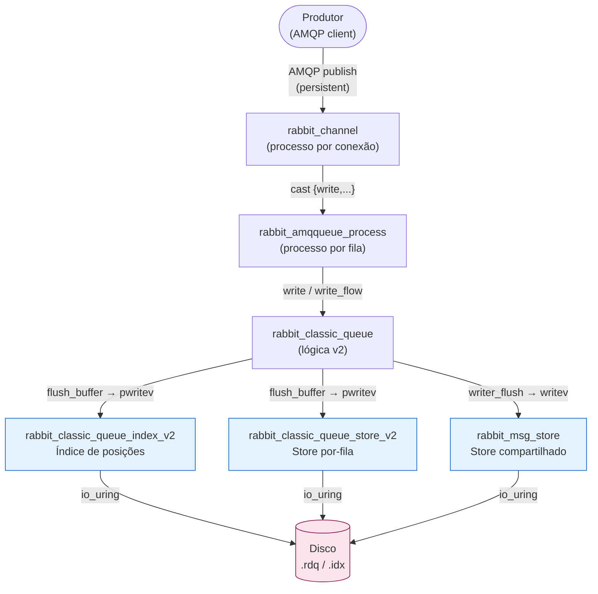

Há **três camadas de armazenamento** distintas, cada uma com seus próprios arquivos de segmento em disco. O io_uring foi integrado nas três (destacadas em azul).

---

## 3. As Três Camadas de Armazenamento

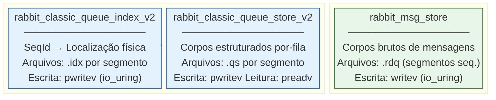

### 3.1 Message Store (`rabbit_msg_store`)

**O que é:** Um servidor `gen_server` compartilhado entre todas as filas clássicas da mesma vhost. Armazena os **corpos brutos** das mensagens em arquivos de segmento sequenciais (`.rdq`). Mensagens de múltiplas filas são intercaladas no mesmo arquivo.

**Como funciona:** As mensagens chegam por mensagens `cast {write, ...}` de vários processos de fila. O message store não grava imediatamente — ele acumula os dados em um buffer em memória (`prim_buffer`) e descarrega em dois casos:

- **Por tamanho:** quando o buffer ultrapassa um limiar definido pelo tamanho da mensagem
- **Por timer/sync:** quando `internal_sync` é chamado (a cada publisher confirm em lote, ou periodicamente)

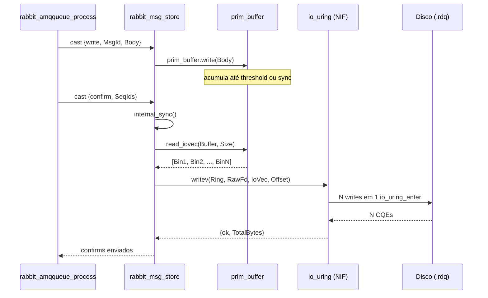

**Estado interno relevante:**
```erlang
#writer{
    fd           :: file:fd(),            %% descritor Erlang (para fallback)
    buffer       :: prim_buffer(),        %% buffer de escrita em memória
    ring         :: ring() | undefined,   %% ring io_uring (quando disponível)
    raw_fd       :: integer() | undefined,%% fd bruto do OS para io_uring
    write_offset :: non_neg_integer()     %% offset atual no arquivo
}
```

**Onde o io_uring entra:**

| Operação | Sem io_uring | Com io_uring |
|---|---|---|
| Flush do buffer (N chunks) | `file:write(Fd, IoVec)` | `writev(Ring, RawFd, IoVec, Offset)` |
| Escrita direta (msg grande) | `file:write(Fd, Data)` | `write(Ring, RawFd, Data, Offset)` |

---

### 3.2 Queue Store (`rabbit_classic_queue_store_v2`)

**O que é:** Um armazenamento **por fila**, gerenciado pelo processo `rabbit_amqqueue_process`. Armazena entradas estruturadas de cada mensagem — offset dentro do segmento, tamanho, CRC32 opcional — em arquivos de segmento dedicados para cada fila.

**Como funciona:** Cada mensagem escrita gera uma entrada no `write_buffer` (um map `SeqId → {Offset, Size, Dados}`). Quando o buffer acumula dados suficientes (ou quando o índice solicita sync), `flush_buffer` consolida as entradas por segmento e as grava. A leitura é feita em lote por `read_many`.

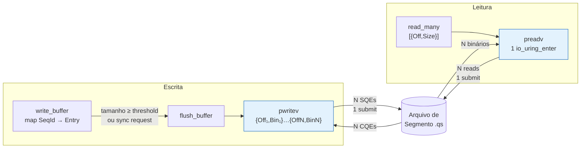

**Onde o io_uring entra:**

| Operação | Sem io_uring | Com io_uring |
|---|---|---|
| Flush do buffer por segmento | `file:pwrite(Fd, [{Offset, Data}])` | `pwritev(Ring, RawFd, [{Offset, Data}])` |
| Leitura em lote (`read_many`) | N × `file:pread(Fd, Offset, Size)` | `preadv(Ring, RawFd, [{Offset, Size}])` |

---

### 3.3 Queue Index (`rabbit_classic_queue_index_v2`)

**O que é:** O índice da fila, também por fila. Mantém o mapeamento entre `SeqId` (número de sequência da mensagem na fila) e a localização física no queue store. É escrito em arquivos de segmento separados, um por intervalo de SeqIds.

**Como funciona:** Publicações, acknowledgements e redeliveries geram entradas no `write_buffer` do índice. Quando o buffer de um segmento enche (ou em eventos de sync), `flush_buffer` consolida as entradas ordenadas por offset e as escreve. O índice pode escrever em **múltiplos segmentos** em um único flush.

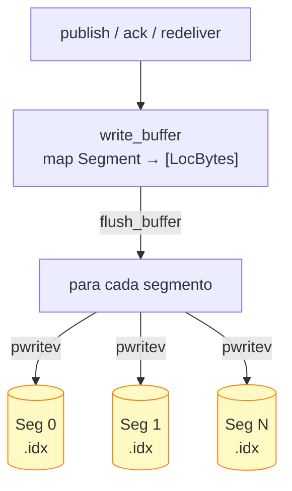

**Onde o io_uring entra:**

| Operação | Sem io_uring | Com io_uring |
|---|---|---|
| Flush por segmento | `file:pwrite(Fd, [{Offset, Data}])` | `pwritev(Ring, RawFd, [{Offset, Data}])` |

---

## 4. O Módulo Adaptador: `rabbit_io_uring`

Para isolar todos os módulos acima da NIF `io_uring`, foi criado o módulo `rabbit_io_uring` como camada de adaptação.

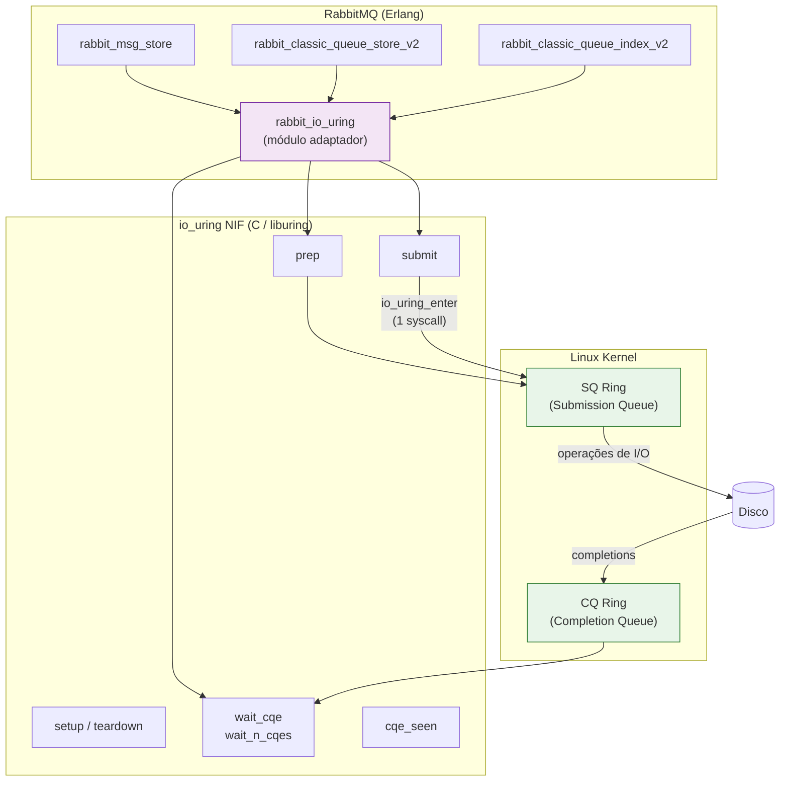

### 4.1 Detecção de Disponibilidade

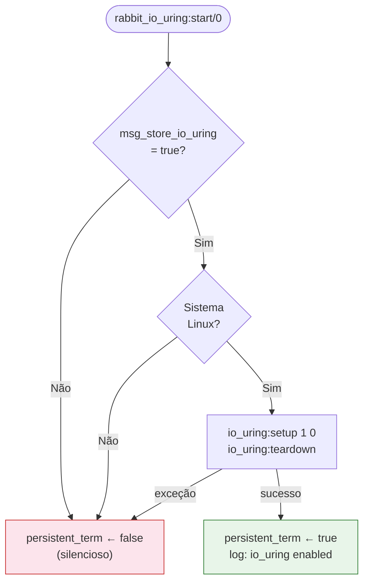

O resultado fica em `persistent_term` — leitura O(1) sem lock — para que `is_available/0` possa ser chamado livremente em hot paths.

### 4.2 Gerenciamento de Rings

Cada contexto de I/O recebe seu **próprio ring dedicado**. O isolamento garante que CQEs de operações distintas nunca se misturem.

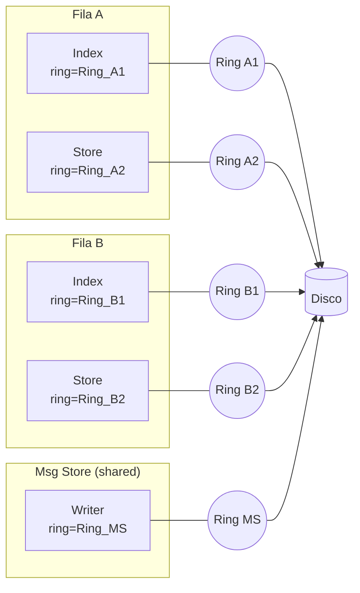

### 4.3 Primitivas de I/O

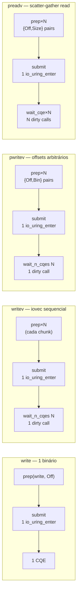

---

## 5. O Modelo de Execução: Dirty Schedulers e Batch CQE Collection

### 5.1 O Problema: N Context Switches por Flush

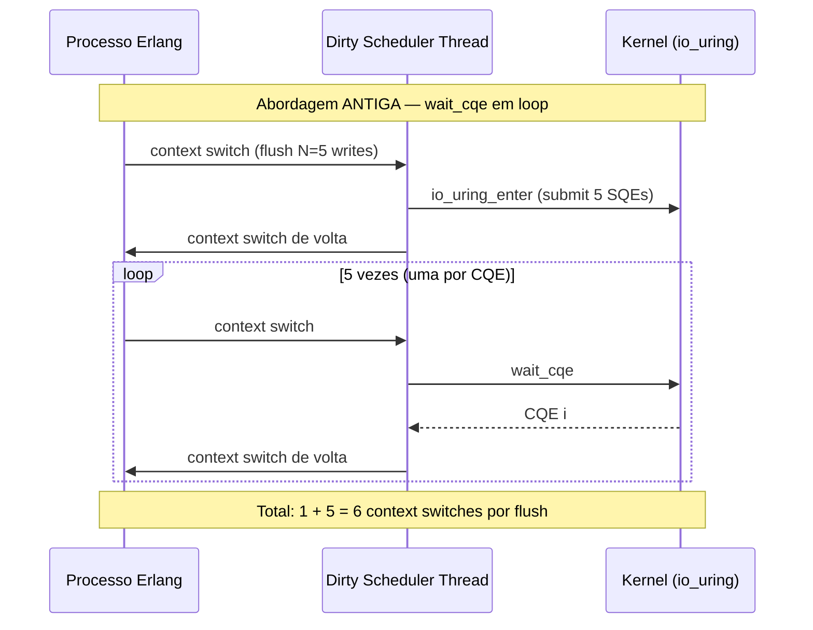

### 5.2 A Solução: `wait_n_cqes` — 1 Context Switch por Flush

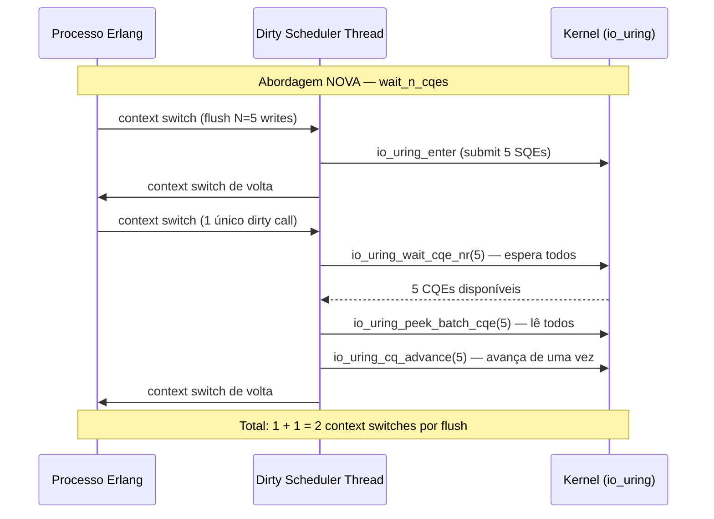

### 5.3 O Bug de Double-Free e sua Correção

A implementação inicial de `nif_wait_n_cqes` chamava `io_uring_peek_batch_cqe` em loop. A função `peek_batch` lê sempre a partir do **head atual do CQ ring, sem avançá-lo**. Quando o primeiro `peek` retornava menos do que N CQEs, o fallback chamava `io_uring_wait_cqe_nr` e depois chamava `peek_batch` novamente — desta vez a partir do **mesmo head** — gerando ponteiros duplicados.

```mermaid
flowchart TD
    subgraph "Versão BUGADA"
        B1["peek_batch(N)\nretorna got=3 < N=5"]
        B2["wait_cqe_nr(2)\nnovos CQEs disponíveis"]
        B3["peek_batch(N-3=2)\nLÊ DO MESMO HEAD!"]
        B4["cqes array:\n0=CQE_A  1=CQE_B  2=CQE_C\n3=CQE_A ⚠️  4=CQE_B ⚠️"]
        B5["sqe_ctx_free(CQE_A.ctx)\nsqe_ctx_free(CQE_A.ctx) ← DOUBLE FREE\n💥 SEGFAULT"]
        B1 --> B2 --> B3 --> B4 --> B5
    end

    subgraph "Versão CORRETA"
        C1["wait_cqe_nr(N=5)\naguarda TODOS disponíveis"]
        C2["peek_batch(N=5)\nUMA única leitura do head"]
        C3["cqes array:\n0=CQE_A  1=CQE_B  2=CQE_C\n3=CQE_D  4=CQE_E  ✓"]
        C4["cq_advance(5)\navança head uma vez\n✅ sem duplicatas"]
        C1 --> C2 --> C3 --> C4
    end

    style B4 fill:#fce4ec,stroke:#c62828
    style B5 fill:#fce4ec,stroke:#c62828
    style C3 fill:#e8f5e9,stroke:#2e7d32
    style C4 fill:#e8f5e9,stroke:#2e7d32
```

---

## 6. Diagrama Completo da Integração

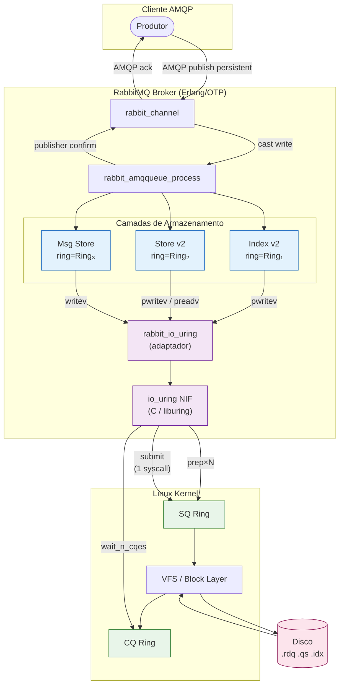

---

## 7. Configuração

A integração é **desabilitada por padrão** e ativada via `rabbitmq.conf`:

```ini
# Habilita io_uring no message store (Linux 5.1+)
message_store.io_uring = true

# Opcional: modo SQPOLL (Linux 5.12+ ou CAP_SYS_NICE)
# O kernel faz polling contínuo do SQ ring, eliminando io_uring_enter por lote
message_store.io_uring_sqpoll = false
```

Quando `message_store.io_uring = false` (padrão), nenhum código novo é executado nos hot paths — o pattern matching nos campos `ring = undefined` da struct de cada camada direciona tudo para o caminho original com `file:write`.
